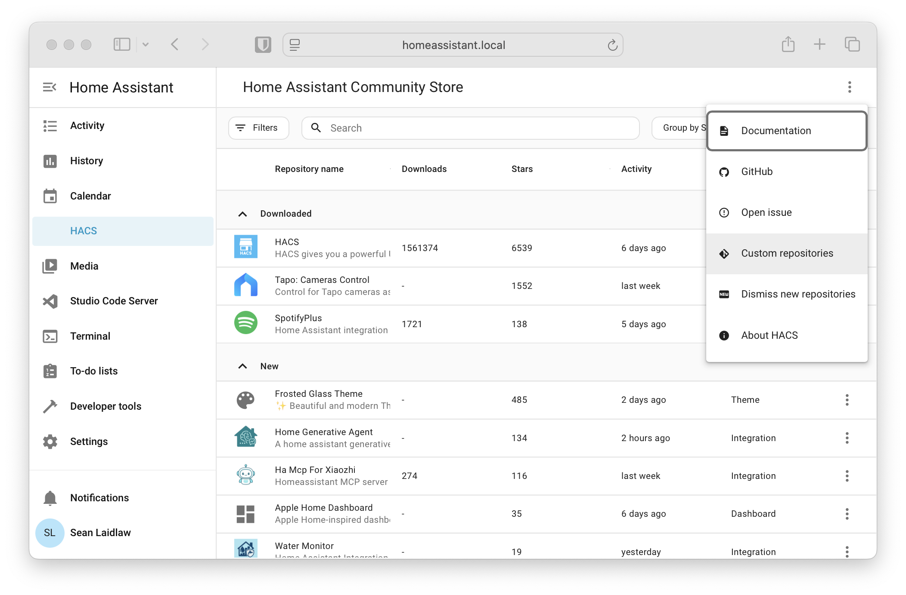
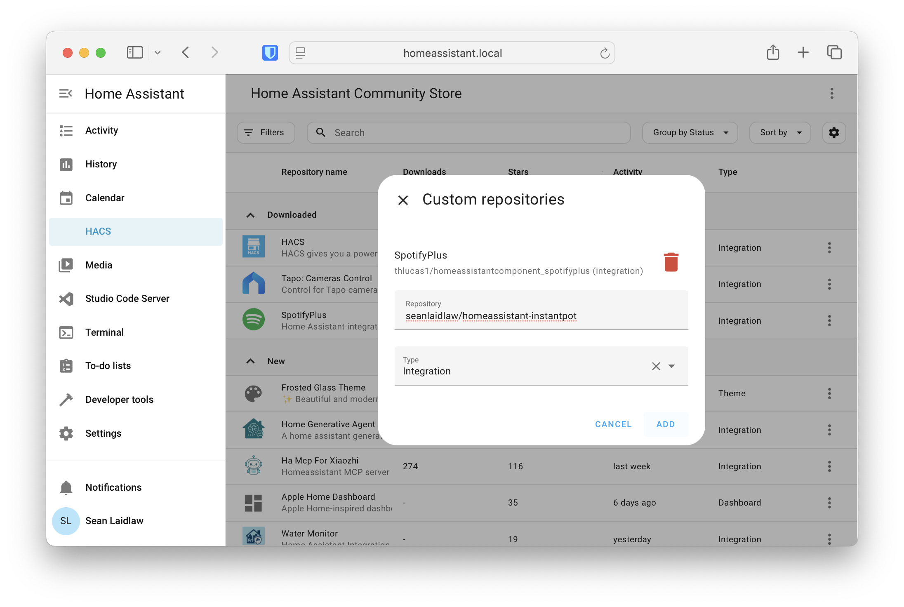
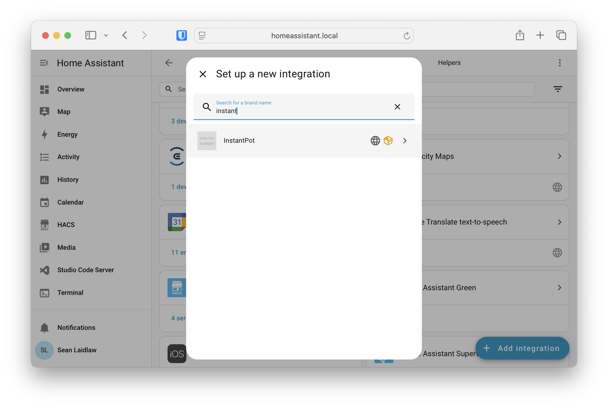
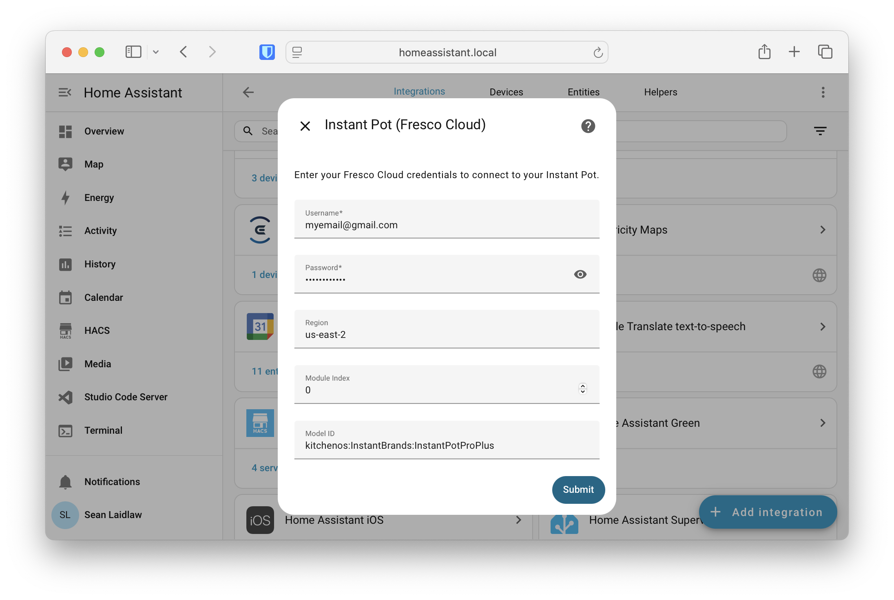
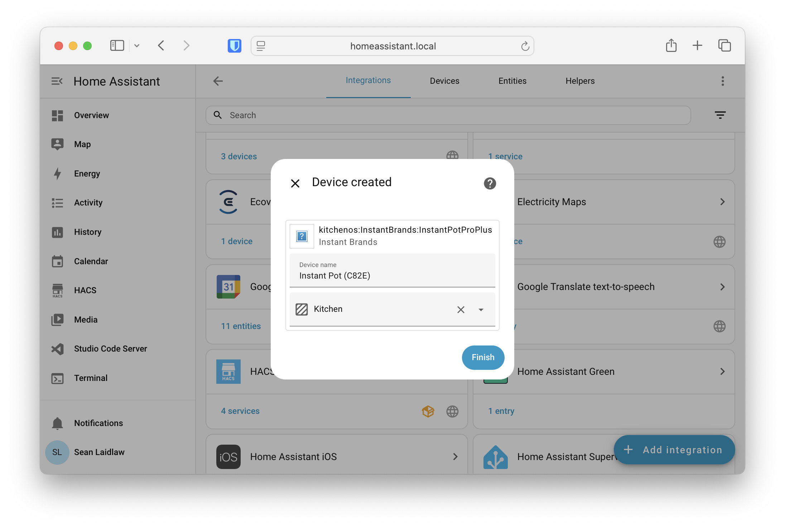
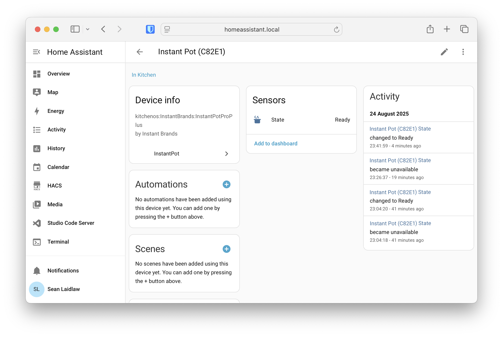
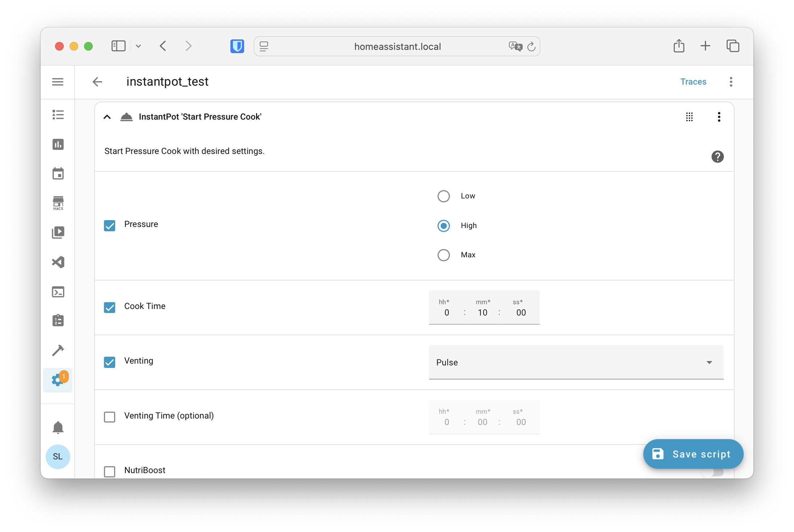

# HomeAssistant – InstantPot Integration

Control your InstantPot via HomeAssistant, using your InstantConnect app login email and password.
This integration exposes Home Assistant services you can call from automations, scripts, or the UI.

## Install (HACS custom repo)
1. Make sure you've installed [HACS](https://hacs.xyz/) already.
2. In HACS → Integrations → **Custom repositories**, add: `seanlaidlaw/homeassistant-instantpot`
Category: Integration.
3. Install **InstantPot** and restart Home Assistant.
4. Settings → Devices & Services → **Add Integration** → *InstantPot*.
5. Enter your InstantPot email and password in the configuration dialog - this is used to renew the access token and fetch devices tracked by InstantConnect.

### Detailed Instructions

1. In HACS → Integrations → **Custom repositories**, add: `seanlaidlaw/homeassistant-instantpot`, with Category: Integration.

2. Install **InstantPot** and restart Home Assistant.

3. Navigate to Settings → Devices & Services → **Add Integration**, and search for *InstantPot* and select the integration.

> [!IMPORTANT]
> The integration works by emulating the iOS app used to communicate with the InstantPot. This means you need to first setup the app on your phone and add the InstantPot device to the app. The process below involves the email and password for this app so you can control it from HomeAssistant

4. To install the integration, it will ask you for configuration details. Enter your InstantConnect email and password (used to login to the app)

5. The integration using your credientials should find the device that is connected to the InstantConnect app and show it as the device name.

6. Once the integration is installed, you can see the device's current state (Ready/Cooking/etc), and will be able to control it through actions and scripts like any other integration.

## Services

Currently the integration only supports the following services:

- Cancel
- Start Keep Warm
- Update Keep Warm
- Start Pressure Cook
- Update Pressure Cook

If you just want to modify an existing program, you can use the update actions (Update Pressure Cook/Update Keep Warm).

> [!TIP]
> If a program is already started, trying to start a new one will silently fail, so you need to add a cancel action first.

In automations or scripts, you can set the program to cook on a specific setting for a given amount of time, and then keep warm:

## License

GPL v3
